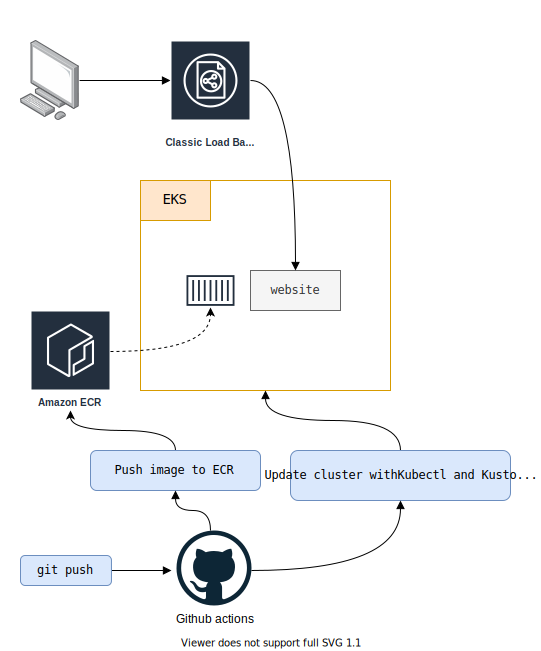

# aws-web-app

Creation of a **website**, hosted on a **Kubernetes cluster**. Use **Kubectl**, **Kustomize** and **Github actions** to deploy it in a **GitOps** way. 

- Updated version using **terraform** and without **eksctl**

## Things that are planned (roadmap)

The following things are on the roadmap until the `v1.0` release

* [x] Improve pipeline

* [ ] Use multiple os

* [ ] Improve error handling

* [ ] Support any pipelines i.e. Gitlab,Github,bitbucket
